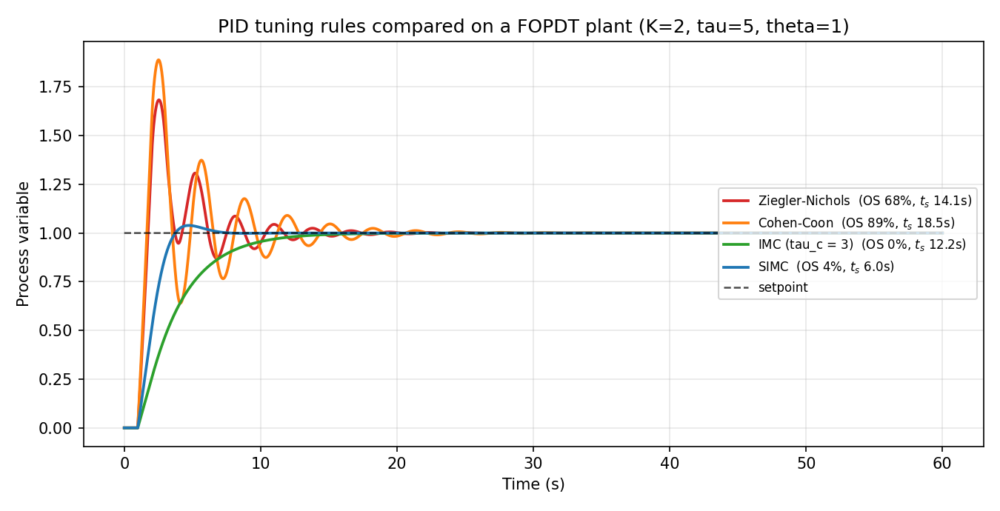

# pidforge

**Control-loop design & PID tuning toolkit for automation engineers.**

`pidforge` is a small, dependency-light Python library that covers the
complete controller-design workflow used in industrial process automation:

step test → process identification → PID tuning → closed-loop simulation → performance evaluation.

It ships with the classic textbook tuning rules (Ziegler–Nichols,
Cohen–Coon, IMC/Lambda, SIMC, Tyreus–Luyben), a discrete-time PID with
anti-windup and derivative filtering, an exact-dead-time simulation engine,
and an optional CLI.

[](https://github.com/Asuna-o/pidforge/actions/workflows/ci.yml)
[](https://www.python.org/)
[](LICENSE)

---

## Features

* **Process models** — FOPDT, SOPDT, underdamped oscillator, integrating
  processes with dead time, all with exact transport-delay handling in
  simulation.
* **Industrial-grade PID** — position form, derivative filter
  (`K_d·N/(s+N)`), setpoint weighting, output limits and conditional
  integration (anti-windup), direct/reverse acting.
* **Tuning rules** — Ziegler–Nichols (open & closed loop), Cohen–Coon,
  IMC/Lambda, SIMC (Skogestad, including integrating processes),
  Tyreus–Luyben. Every rule returns `kp/ki/kd` *and* the equivalent
  `ti/td` used on real DCS/PLC systems.
* **Identification** — fit a FOPDT model from step-test data with the
  two-point (28.3 %/63.2 %) or area (moments) method.
* **Simulation** — fixed-step RK4/Euler integration, setpoint trajectories,
  load disturbances, actuator saturation.
* **Metrics** — rise time, settling time, overshoot, steady-state error,
  IAE, ISE, ITAE, ITSE and control-effort total variation.
* **CLI** — `pidforge tune`, `pidforge simulate`, `pidforge identify` for
  quick experiments without writing code.
* **Zero magic** — only NumPy as a runtime dependency; plotting is optional.



*Four PID tuning rules applied to the same FOPDT plant — SIMC wins on both
overshoot and settling time.*

## Installation

```bash
pip install pidforge            # core
pip install "pidforge[plot]"    # + matplotlib for plotting
pip install "pidforge[dev]"     # + development tools (pytest, ruff)
```

## Quickstart

```python
from pidforge import FOPDT, PIDController, simulate, compute_metrics
from pidforge.tuning import simc_pi

# 1. Process model:  K = 2, tau = 5 s, dead time = 1 s
plant = FOPDT(gain=2.0, tau=5.0, theta=1.0)

# 2. Tune a PI controller with SIMC
params = simc_pi(plant)
controller = PIDController(kp=params.kp, ki=params.ki)

# 3. Simulate a setpoint step
result = simulate(plant, controller, setpoint=1.0, dt=0.01, t_end=60.0)

# 4. Evaluate
metrics = compute_metrics(result)
print(f"overshoot = {metrics.overshoot_pct:.1f}%")
print(f"settling  = {metrics.settling_time:.2f} s")
print(f"IAE       = {metrics.iae:.3f}")
```

## The real workflow: identify from a step test

```python
import numpy as np
from pidforge import open_loop_step, tune_from_step_data
from pidforge.models import FOPDT

# Run a (simulated) step test: bump the valve and record the response.
plant = FOPDT(gain=2.0, tau=5.0, theta=1.0)
step_test = open_loop_step(plant, u=1.0, dt=0.01, t_end=60.0)

# Identify a FOPDT model and tune in one call.
model, params = tune_from_step_data(
    step_test.time, step_test.output,
    input_step=1.0, fit_method="area", tuning="simc",
)
print(model)                     # FOPDT(gain≈2, tau≈5, theta≈1)
print(params.summary())          # PI (SIMC): kp=1.25, ti=5, ...
```

## Supported tuning rules

| Rule | Type | Model | Notes |
|------|------|-------|-------|
| Ziegler–Nichols open loop | P / PI / PID | FOPDT | classic reaction-curve |
| Ziegler–Nichols closed loop | P / PI / PID | `ku`, `tu` | ultimate gain/period |
| Cohen–Coon | P / PI / PID | FOPDT | quarter-amplitude decay |
| IMC / Lambda | PI / PID | FOPDT | detuning via `tau_c` |
| SIMC (Skogestad) | PI | FOPDT | robust, near-optimal disturbance rejection |
| SIMC (integrating) | PI | integrator + dead time | level / position loops |
| Tyreus–Luyben | PI / PID | `ku`, `tu` | conservative closed-loop |

## Command line

```bash
# List models
pidforge models

# Tune
pidforge tune --plant fopdt:2,5,1 --method simc
pidforge tune --plant fopdt:2,5,1 --all

# Simulate
pidforge simulate --plant fopdt:2,5,1 --tuning simc --setpoint 1 --horizon 60
pidforge simulate --plant fopdt:2,5,1 --tuning 1.25:0.25 --disturbance 0.3:20 --csv resp.csv
pidforge simulate --plant fopdt:2,5,1 --tuning simc --plot response.png

# Identify from a step-test CSV (columns: t, y, u)
pidforge identify step_test.csv --method area --tune simc
```

## API overview

| Module | Contents |
|--------|----------|
| `pidforge.models` | `FOPDT`, `SOPDT`, `Oscillator`, `IntegratorDelay`, `parse_model` |
| `pidforge.tuning` | `ziegler_nichols_open_loop`, `ziegler_nichols_closed_loop`, `cohen_coon`, `imc_pi`, `imc_pid`, `simc_pi`, `simc_integrator`, `tyreus_luyben`, `auto_tune` |
| `pidforge.controller` | `PIDController` (anti-windup, derivative filter, setpoint weighting) |
| `pidforge.simulate` | `simulate`, `open_loop_step`, `step_setpoint`, `tuned_simulation` |
| `pidforge.metrics` | `compute_metrics` → rise/settle/overshoot, IAE, ISE, ITAE, ITSE, TV |
| `pidforge.identification` | `fit_fopdt`, `tune_from_step_data` |
| `pidforge.plotting` | `plot_response`, `plot_comparison` (optional matplotlib) |
| `pidforge.cli` | terminal entry point |

## Development

```bash
pip install -e ".[dev]"
ruff check src tests
pytest
```

CI runs lint + tests + build on Python 3.9–3.12 (Linux & Windows).

## Roadmap

* Frequency-domain robustness metrics (gain/phase margin, `M_s`)
* MIMO / cascade loop support
* Auto-tune experiments (relay feedback) to obtain `ku`, `tu`
* Interactive tuning dashboard (static HTML export)

## License

MIT — see [LICENSE](LICENSE).
